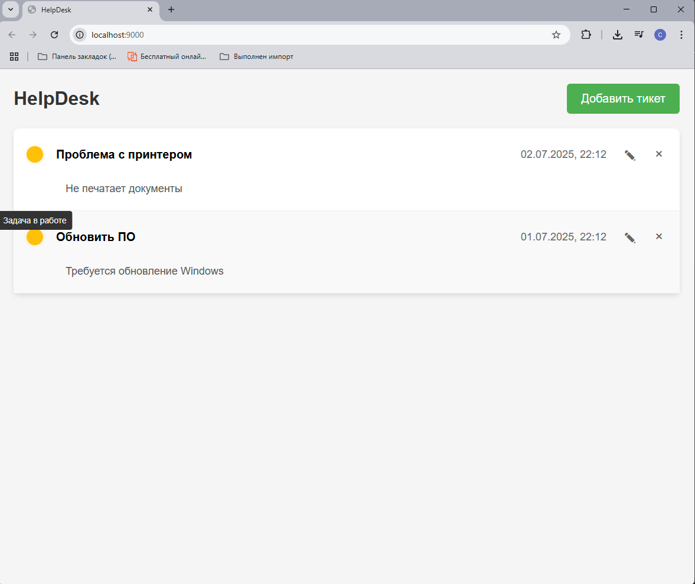
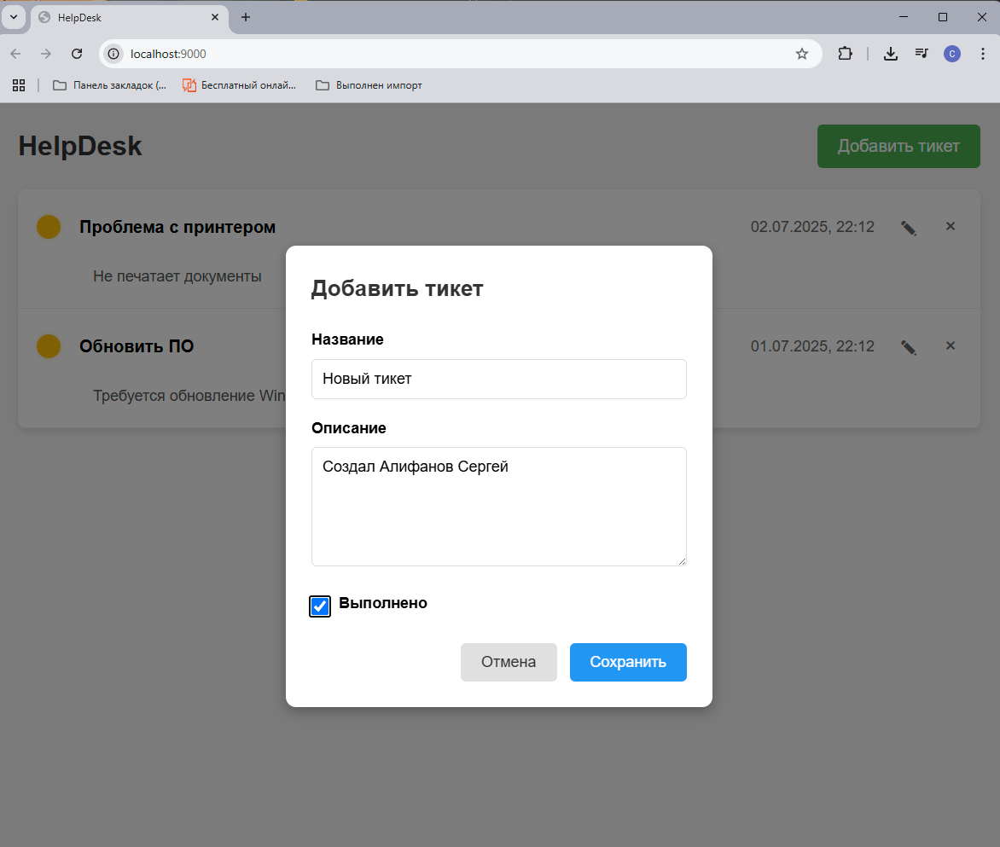
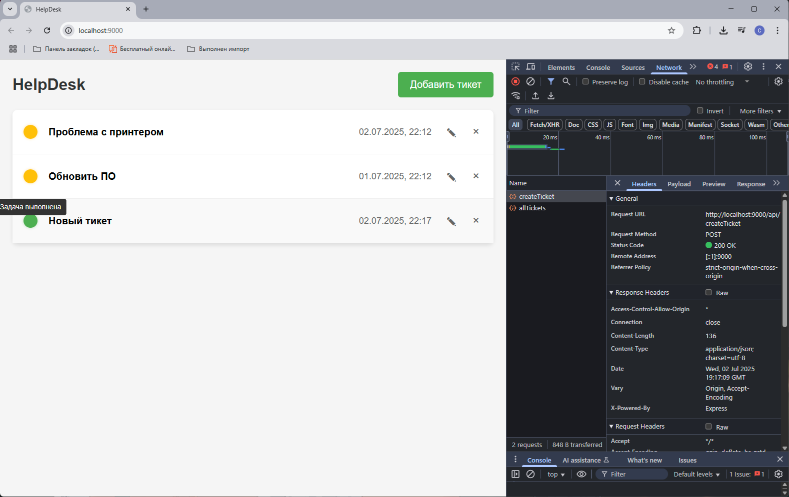

# alifanov-ahj-http

# HelpDesk

Простое приложение для управления заявками (HelpDesk) с бэкендом на Koa и фронтендом на JavaScript.

## Описание

HelpDesk — это веб-приложение для создания, редактирования, удаления и просмотра заявок (тикетов). Бэкенд реализован с использованием Koa и предоставляет REST API для работы с тикетами. Фронтенд построен с использованием Webpack и отображает список тикетов, позволяет добавлять новые, редактировать существующие и удалять их.

### Функционал
- Отображение списка тикетов
- Создание нового тикета
- Редактирование тикета
- Удаление тикета
- Просмотр подробного описания тикета
- Отметка статуса выполнения тикета

